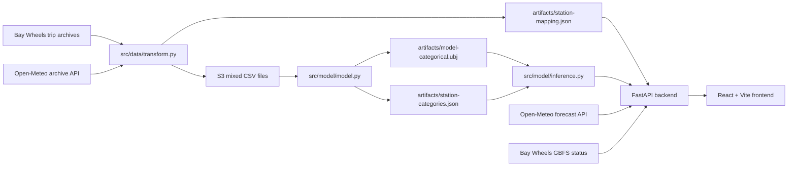

# Flowcast

Flowcast predicts short-term bike station net flow for the Bay Area. It combines Bay Wheels trip history, station coordinates, calendar features, weather data, a trained XGBoost regression model, a FastAPI backend, and a map-first React frontend.

## Overview

Flowcast estimates the signed net bike flow at a station for a 15-minute window:

- Positive values indicate net arrivals.
- Negative values indicate net departures.
- Near-zero values indicate a balanced station.

The project is organized around four pieces:

- `src/data/` downloads and transforms raw Bay Wheels trip data into model-ready rows.
- `src/model/` trains, evaluates, saves, and loads the XGBoost model.
- `src/api/` serves station metadata and live station forecasts through FastAPI.
- `frontend/` renders an interactive Bay Area map and station detail panel.

The user-facing workflow is simple: load the map, select a station, and view the current predicted 15-minute net flow alongside weather and live bike availability.

## Architecture

Flowcast is a local full-stack application. The backend owns data loading, artifact serving, and model inference. The frontend consumes the backend over HTTP and renders station state with MapLibre GL.



Important paths:

- `main.py` is the CLI entrypoint for ETL, training, evaluation, and serving.
- `src/data/load.py` builds Bay Wheels archive URLs and uploads transformed files to S3.
- `src/data/transform.py` converts trips into station-level 15-minute net-flow rows.
- `src/model/model.py` trains the categorical XGBoost regressor and writes model artifacts.
- `src/model/eval.py` evaluates the saved model against held-out S3 files.
- `src/model/inference.py` loads the saved booster and station category artifact for prediction.
- `src/api/station.py` serves `artifacts/station-mapping.json`.
- `src/api/live.py` fetches live weather and GBFS availability, derives calendar features, and runs inference.
- `frontend/src/` contains the React application, API client, map, panels, and UI state.

## Model Data Gathering Process

The training data starts from Bay Wheels monthly trip archives hosted at `https://s3.amazonaws.com/baywheels-data`. `src/data/load.py` constructs the expected archive names from 2017 through the configured `LAST_MONTH_CODE`, handles known naming differences, downloads each zip, reads the matching CSV, and uploads transformed output to S3.

`src/data/transform.py` prepares model rows by:

- normalizing historical column names such as `started_at` to `start_time`;
- validating station IDs, timestamps, and coordinates;
- flooring trip start and end timestamps into 15-minute buckets;
- decrementing net flow for departures and incrementing net flow for arrivals;
- preserving stable station coordinates, with a small movement threshold;
- deriving calendar features: day of week, time bucket, weekend flag, ISO week, month, federal holiday flag, and commute-hour flag;
- fetching hourly historical weather from Open-Meteo for each station coordinate and date span;
- attaching temperature, precipitation, and wind to each station bucket.

The model-ready schema is:

```text
day_of_week, time_bucket, is_weekend, week_of_year, month,
is_us_federal_holiday, commute_hours, station_id,
temperature, precipitation, wind, net_flow
```

Generated artifacts are stored under `artifacts/`:

- `station-mapping.json` maps station IDs to latitude and longitude for the frontend and live API.
- `station-categories.json` stores the categorical station ID vocabulary used by XGBoost inference.
- `held-out-keys.json` stores the S3 CSV keys reserved for evaluation.
- `model-categorical.ubj` is the trained XGBoost model artifact produced by training. This file is required for prediction but is not present in the current repository snapshot.

`src/data/predicthq.py` can export nearby PredictHQ events to `artifacts/predicthq_events.json`, but the current model feature list in `src/model/model.py` does not include event-derived fields.

## Model Training Process and Results

Training is implemented in `src/model/model.py`. The pipeline reads mixed CSV parts from the `lyft-training-data-mixed` S3 bucket, validates that each file contains the expected model columns, normalizes station IDs, drops rows with integer-only station IDs, and trains an XGBoost regressor with native categorical support for `station_id`.

The training split is defined in code:

- 100 expected mixed CSV files.
- 95 training files.
- 5 held-out evaluation files.
- 5 of the training files reserved for validation.

The model uses `reg:absoluteerror` with MAE as the evaluation metric, histogram tree construction, early stopping, and categorical splits. The current validation run reports an MAE of `1.08`. Training writes:

- `artifacts/model-categorical.ubj`
- `artifacts/station-categories.json`
- `artifacts/held-out-keys.json`

Evaluation is implemented in `src/model/eval.py`. It loads the held-out keys, compares the trained model against random and zero baselines, and prints exact rounded accuracy, MAE, MSE, and RMSE. Held-out metrics are produced by the evaluation command:

```bash
python main.py --eval
```

## Backend APIs

The FastAPI app is created in `main.py` and served on port `9000` with:

```bash
python main.py --server
```

### `GET /stations`

Returns `artifacts/station-mapping.json` as JSON.

Response shape:

```json
{
  "SF-F28-3": [37.0, -122.0]
}
```

### `POST /predict`

Runs direct model inference for a supplied feature row.

Request body:

```json
{
  "day_of_week": 2,
  "time_bucket": 35,
  "is_weekend": false,
  "week_of_year": 32,
  "month": 8,
  "is_us_federal_holiday": false,
  "commute_hours": true,
  "station_id": "SF-F28-3",
  "temperature": 59.1,
  "precipitation": 0.0,
  "wind": 4.8
}
```

Response body:

```json
{
  "prediction": 12.34,
  "temperature": 59.1,
  "precipitation": 0.0,
  "wind": 4.8
}
```

The endpoint validates the request with Pydantic, loads the XGBoost booster through `src/model/inference.py`, verifies that `station_id` exists in `station-categories.json`, and returns a rounded prediction.

### `GET /stations/{station_id}/live`

Builds a live prediction for one station.

The endpoint:

- loads station coordinates from `station-mapping.json`;
- fetches current temperature, precipitation, and wind from Open-Meteo;
- fetches live bike, e-bike, dock, and disabled-bike counts from Bay Wheels GBFS;
- floors the current local time to a 15-minute bucket;
- derives the calendar features used during training;
- runs `predict_net_flow`.

Response body:

```json
{
  "station_id": "SF-F28-3",
  "prediction": 12.34,
  "temperature": 59.1,
  "precipitation": 0.0,
  "wind": 4.8,
  "num_bikes_available": 8,
  "num_ebikes_available": 2,
  "num_docks_available": 11,
  "num_bikes_disabled": 0
}
```

GBFS availability is cached for 60 seconds in process.

## UI

The frontend in `frontend/` is a React 18, TypeScript, Vite, MapLibre GL, TanStack Query, Zustand, Tailwind CSS, and Framer Motion application.

The main interface is a dark Bay Area map:

- `FlowcastMap` renders stations as a single GeoJSON source with MapLibre circle layers.
- `HeaderBar` shows app status and the loaded station count.
- `Legend` explains inflow, outflow, and balanced states.
- `StationDetailPanel` opens when a station is selected and displays prediction, direction, magnitude, weather, live bike availability, and refresh state.
- TanStack Query loads `/stations` and refetches `/stations/{id}/live` every 60 seconds while a station panel is open.
- Zustand stores selected and hovered station IDs.

In local development, Vite proxies `/stations` and `/predict` to `http://127.0.0.1:9000`, so the browser can call the backend without CORS setup.

## How to Run

### Prerequisites

- Python 3.11 or newer
- Node.js and npm
- AWS credentials if running ETL, training, or evaluation against S3
- A trained `artifacts/model-categorical.ubj` file for prediction endpoints

### Backend Setup

From the repository root:

```bash
python3 -m venv .venv
source .venv/bin/activate
pip install -r requirements.txt
```

Run the API:

```bash
python main.py --server
```

The backend listens on `http://127.0.0.1:9000`.

### Frontend Setup

From `frontend/`:

```bash
npm install
npm run dev
```

Open `http://localhost:5173`.

For production-style builds:

```bash
npm run build
npm run preview
```

Set `VITE_API_URL` in `frontend/.env.local` when the frontend is deployed separately from the backend. Leave it unset for local development with the Vite proxy.

### ETL, Training, and Evaluation

Run ETL for a slice of the Bay Wheels archive catalogue:

```bash
python main.py --data 0 10
```

Create mixed S3 training parts from transformed CSV files:

```bash
python src/model/data.py
```

Train the model:

```bash
python main.py --train
```

Evaluate the saved model:

```bash
python main.py --eval
```

The data and training steps require AWS credentials and S3 access. Relevant environment variables include:

- `AWS_ACCESS_KEY_ID`
- `AWS_SECRET_ACCESS_KEY`
- `AWS_REGION`
- `S3_BUCKET`
- `WEATHER_TIMEZONE`
- `WEATHER_COORD_DECIMALS`
- `PREDICTHQ_API_KEY`, only for `src/data/predicthq.py`

### Tests

Backend tests use pytest:

```bash
pytest
```

The prediction tests skip automatically when `artifacts/model-categorical.ubj` or `artifacts/station-categories.json` is unavailable.
